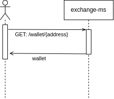
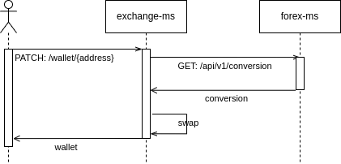

# Workshop de observavilidad.

## Intrucciones para levantar los servicios.

### exchange-bff

```
cd exchange-bff
```
```
npm run start
```

### forex-ms

```
cd feorex-ms
```
```
./gradlew quarkusDev
```

### docker-compose

Para levantar todo el sistema incluído elastic stack:
```
docker-compose build --parallel
docker-compose up -d
```

Para detener todos los containers 
```
docker-compose down -v
```

## Ejercicio

Tenemos este sistema legacy, que heredamos de un antiguo cliente, que pretendía lanzar una billetera de criptomonedas.

Dicho sistema consta de dos componentes, el exchange-bff, que tiene la función de mediar entre el core y los posibles fronts que vayan a consumirnos (app, web, etc), y el forex-ms, que tiene la responsabilidad de buscar el precio unitario de conversión de una moneda con respecto a otra. 

Actualmente, como está en versión de prueba, solo cuenta con 3 casos de uso:

1- Obtener conversión de entre dos monedas.



2- Obtener el balance actual de una billetera.


3- Realizar la conversión entre dos de las monedas que se encuentren en el balance de una billetera.



Actualmente tenemos un bug reportado, pues al parecer, cada vez que le pegan al BFF para intentar realizar un movimiento de alguna moneda hacia otra, este arroja un error 500 y no sabemos bien por qué es. Nuestra primera tarea es identificar el problema e intentar resolverlo agregando logs a discreción.

En el caso de que alguna de las dos monedas no existan en nuestra base, se está lanzando un error 500, lo cual, podría no estar del todo bien. Esta tarea consiste en solucionar este problema, al mismo tiempo que vamos agregando logs que nos puedan ayudar a detectar dónde está el inconveniente.

A tener en cuenta:

* Cada log debe tener un nivel coherente con su contexto.
* Se tendrá en cuenta la consistencia de los logs (ej, no loguear en distintos idiomas con formatos distintos).

