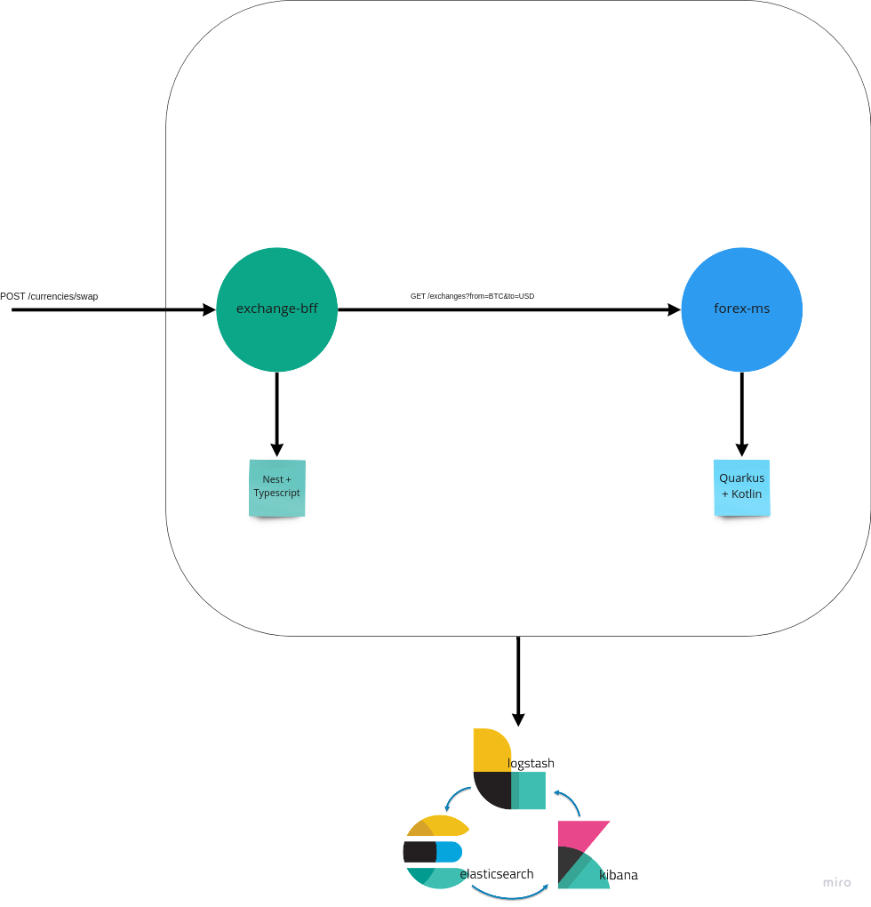

# Workshop de observavilidad.

## Precondiciones

* [NPM](https://github.com/nvm-sh/nvm)
* [JDK](https://sdkman.io/)
* [Docker-compose](https://docs.docker.com/compose/install/)


## Intrucciones para levantar los servicios.

### exchange-bff

```
cd exchange-bff
```
```
npm run start
```

### forex-ms

```
cd feorex-ms
```
```
./gradlew quarkusDev
```

### docker-compose

Para levantar todo el sistema incluído elastic stack:
```
docker-compose build --parallel
docker-compose up -d
```

Para detener todos los containers 
```
docker-compose down -v
```

## Misión

Tenemos un sistema que en teoría nos permitiría conocer el balance de nuestra billetera electrónica, convertir de una moneda a otra (BTC, ETH, USD, LTC, BEE, ADA) y realizar un movimiento dentro la misma billetera (BTC -> ETH, USD -> ETH, etc):

1- Obtener el balance actual de una billetera.


2- Obtener conversión de entre dos monedas.


3- Realizar la conversión entre dos de las monedas que se encuentren en el balance de una billetera.


Dicho sistema consta de dos componentes, el exchange-bff, que tiene la función de mediar entre el core y los posibles fronts que vayan a consumirnos (app, web, etc), y el forex-ms, que tiene la responsabilidad de buscar el precio unitario de conversión de una moneda con respecto a otra. 



### Objetivos:
1. Al intentar los dos últimos casos de uso (consultar conversión entre dos monedas y convertirlas dentro de nuestra billetera), está arrojándose un error 500 (Internal Server Error). Debemos diagnosticar que puede estar pasando y darle solución

2. Agregar logs necesarios y suficientes para facilitar dicho diagnóstico, teniendo en cuanta que cada log debe cumplir con los sigts requisitos:

* Deben tener un nivel apropiado según su contexto
* Deben poder responder las preguntas What? When? Where? Who?

Documentación útil
* https://es.quarkus.io/guides/logging
* https://docs.nestjs.com/techniques/logger